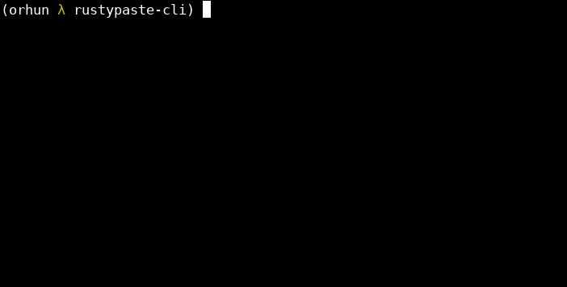

<a href="https://github.com/orhun/rustypaste-cli"></a>

A CLI tool for [**rustypaste**](https://github.com/orhun/rustypaste).



## Installation

### crates.io

```sh
cargo install rustypaste-cli
```

#### Features

- `use-native-certs`: makes the default TLS implementation use the OS' trust store. [\*](https://github.com/algesten/ureq#https--tls--ssl) (disabled)

To enable crate features, use the `--features` flag as follows:

```sh
cargo install rustypaste-cli --features use-native-certs
```

### Arch Linux

```
pacman -S rustypaste-cli
```

### Alpine Linux

`rustypaste-cli` is available for [Alpine Edge](https://pkgs.alpinelinux.org/packages?name=rustypaste-cli&branch=edge). It can be installed via [apk](https://wiki.alpinelinux.org/wiki/Alpine_Package_Keeper) after enabling the [testing repository](https://wiki.alpinelinux.org/wiki/Repositories).

```sh
apk add rustypaste-cli
```

### Binary releases

See the available binaries on [releases](https://github.com/orhun/rustypaste-cli/releases/) page.

### Build from source

```sh
git clone https://github.com/orhun/rustypaste-cli.git
cd rustypaste-cli/
cargo build --release
```

## Usage

`rpaste [options] <file(s)>`

```
-h, --help           prints help information
-v, --version        prints version information
-V, --server-version retrieves the server version
-l, --list           lists files on the server
-d, --delete         delete files from server
-o, --oneshot        generates one shot links
-p, --pretty         prettifies the output
-c, --config CONFIG  sets the configuration file
-s, --server SERVER  sets the address of the rustypaste server
-a, --auth TOKEN     sets the authentication or delete token
-u, --url URL        sets the URL to shorten
-r, --remote URL     sets the remote URL for uploading
-e, --expire TIME    sets the expiration time for the link
```

### Set credentials

Either set the credentials on the command line (not recommended):

```sh
rpaste -s "https://paste.example.com" -a "<token>"
```

or specify them in the [configuration file](#configuration).

### Upload files

```sh
rpaste awesome.txt other.txt
```

### Upload from stdin

```sh
echo "Hello World" | rpaste -
```

### Shorten URLs

```sh
rpaste -u https://example.com/some/long/url
```

### Paste from URL

```sh
rpaste -r https://example.com/file.txt
```

### One shot

```sh
rpaste -o disappear_after_seen.txt
```

### One shot URL

```sh
rpaste -ou https://example.com/some/long/url
```

### Expiration

```sh
rpaste -e 10min expires_in_10_minutes.txt
```

```sh
rpaste -e 1hour -u https://example.com/expire/1hour
```

\* Supported units: `ns`, `us`, `ms`, `sec`, `min`, `hours`, `days`, `weeks`, `months`, `years`

### List uploaded files

```sh
rpaste -l
```

\* Use `-p` for table output instead of JSON.

### Delete files from server

```sh
rpaste -d awesome.UA86.txt other.JSNI.txt
```

### Extras

- Show a _prettier_ output: `rpaste -p [...]`
- [Disable colors](https://no-color.org/) in the output: `NO_COLOR=1 rpaste -p [...]`

## Configuration

The configuration file can be specified via `--config` argument and `RPASTE_CONFIG` environment variable or it can be placed to the following global locations:

- `<config_dir>` `/` `rustypaste/config.toml`
- `<home_dir>` `/` `.rustypaste/config.toml`

`<config_dir>` depends on the platform as shown in the following table:

| Platform | Value                                 | Example                                  |
| -------- | ------------------------------------- | ---------------------------------------- |
| Linux    | `$XDG_CONFIG_HOME` or `$HOME`/.config | /home/alice/.config                      |
| macOS    | `$HOME`/Library/Application Support   | /Users/Alice/Library/Application Support |
| Windows  | `{FOLDERID_RoamingAppData}`           | C:\Users\Alice\AppData\Roaming           |

See [config.toml](./config.toml) for configuration options.

## Contributing

Pull requests are welcome!

#### License

<sup>
All code is licensed under <a href="LICENSE">The MIT License</a>.
</sup>
